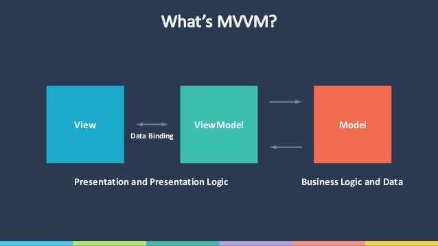

- title : Build a Xamarin Forms App with F#, with Sam Williams
- description : mobile apps, xamarin froms and lots of F#
- author : Sam Williams
- theme : night
- transition : default

***
### Building Xamarin Forms apps with F#
#### by Sam Williams

Twitter: @willsam100

Company: EROAD - Mobile Developer

<small>All opinions are my own</small>

***
### What I'll cover

- The current status of Mobile
- How Xamarin Forms works
- F# and Xamarin 
- Functional F# with Xamarin
- Some challenges with F#, .NET and mobile

***
### Real quick re-cap of Mobile

- Android iOS, Windows
- Generally very similar
    - pages, buttons, camera, etc
- Technically rather different
    - iOS: UIButton, UIViewController
    - Android: Button, Fragments/Activites
- Different languages: Objective-C, swift, Java (Scala)

***
### Details about mobile

- Building multiple versions of the same app <strike>is expensive</strike> sucks
- Ignoring 'hybrid/web' cross platfrom solutions
    - These are slow 
    - Limited access to device APIs

***
### The 2 (and a half) contenders (using F#)

- React Native
- Xamarin 
- Xamarin Forms 

***
### I'm choosing Xamairn Forms but

- F#  + Fable can be used with React Native
- It's community supported
- Javascript is involved :(

***
### Overview of Xamarin

- Mono allows .NET code to be executed on the device
- Xamarin have ported all the native device APIs to .NET
- write the core of the app in a shared layer
- (re) write only the UI for each platform

***
### Overview of Xamarin Forms

- Share the UI layer accross platforms
- Write each screen using abstract UI elements
- Can use xaml (subset of WPF) to describe UI elements
- UI elements are compiled to platform object ie Button -> UIButton

***

 

***
### Recap: MVVM is the standard architecture

- design pattern
- model -> view -> ViewModel
- Allows for unit testing of the view  

***
### MVVM is the standard architecture

 

***
### Where's the F#

- Demo of a TODO app
- Use F# instead of C# 
- Will require OO 
- The only change made is the langauge - a 'safe' change

' Demo putting the app together
'   Show project structure and where things are
'   Add in view model 
'   highlight F# helping with types
'   update unit tests (Version 3 is better)
'   Possible to use Property based testing
'   - Not the best support with Xamarin Studio. 
'   - NUnit is the only stable (ish) framework

' Unit tests 
' Replace the core with Functional style

***
### Pros & Cons

- Pros
    - Great for enterprise 
    - Should be able to buid anything
- Cons
    - View models hold state
    - Lot's of objects
    - variables are evil (well..source of bugs)

***
### A functional architecture

> Elm is a domain-specific programming language for declaratively creating web browser-based graphical user interfaces. Source: wikipedia

***
### The Elm Architecture
#### It's all about flow

***
### The Elm Architecture
#### Applied to Xamarin Forms

***
### The Elm Architecture
#### One state to rule them all

- Hold a single object with all state
- copy the state for a each change
- update the view on each change
- trigger a change from the limited user action

***
### Welcome Gjallarhorn
### Much better, but how?

- Gjallarhorn is a framework
    - supports WPF
    - Supports Xamarin Forms
- Ouput bindings rather than HTML/CSS/JS 
- Continue to use Xmal for the describing the UI
- will model the uni-directional flow 
- Bindings + observables couples UI actions/updates 
- UI is still written in xaml

***
### A simple example 

- two buttons, increment - decrement
- output label
- uses a state object
- uses functions to change the state
- Gjallarhorn handles everything else

***
### A bigger app: Real Change

- A single watchlist for all your real estate
- Track the changes of a listing (price, title etc)
- Two websites currently supported (scrpped)
    - TradeMe.co.nz
    - RealEstate.co.nz

***
### A bigger app: Real Change

- Mailbox Processor to hold the state
- Mailborx is nicely wrapped up in Gjallarhorn
- sqlite3 db
- network calls (HTML scraping)

***
### A bigger app: Real Change

*** 
### App Model

    type AddListingModel = {
        OutputMessage: string
        ItemAdded: bool
        IsValidatingItem: bool
        EntryText: string }
    type CurrentPage = ListingsPage | AddListingPage | ListingChangesPage | About
    type Model = { 
        Items : FullListing list 
        ShowRemovedListings: bool
        IsRefreshing: bool
        AddListingModel: AddListingModel option
        ListingChanges: ListingId option
        CurrentPage: CurrentPage }
***
### App Commands

    type Update =
        | FetchItems of FullListing list
        | ItemSaved
        | RefrehedItems of FullListing list
        | ItemValidated of FullListing option
        | DeletedListing of ListingId
        | DeletedListingFailed of string

    RequestAction = 
        | RequstLoad
        | RequstRefresh
        | AddListingMessage of string
        | SetListingDetail of (NavigationDetails * ListingId)
        | DeleteListing of ListingId
        | ToggleShowRemoved 

     Msg = 
        | RequestAction of RequestAction
        | RequestCompleted of Update
        | ChangePage of ChangePage
        | Loop
        
***
### State/update function

    type StateManagement (navPage: NavigationPage, loadItems: unit -> unit, 
        saveListing, validateListing, refreshListings, deleteListing) =

        // .. rest of helper functions here

        let update (msg : Msg) (current : Model) = 
            match msg with
            | Msg.RequestAction m -> requestAction m current
            | Msg.RequestCompleted u -> handleUpdateItems u current
            | Msg.ChangePage cp -> handleChangePage cp current
            | Msg.Loop -> current

        let initialModel: Model = // default starting value  

        let state = new AsyncMutable<Model>(initialModel)

        member __.Update msg = 
            update msg |> state.Update |> ignore

***
### Add a listing page

    let addListing source (model: ISignal<Model>) = 
        model |> Signal.map (fun x ->  x.AddListingModel.OutputMessage)
        |> Binding.toView source "Output"
        
        model |> Signal.map (fun x -> x.AddListingModel.EntryText)
        |> Binding.toView source "ListingText"
            
        let isNotLoadingContent = model |> Signal.map (fun x -> true)
        let isOnAddListingPage = model |> Signal.map (fun x -> true)
        let canExecute = Signal.map2 (&&) isNotLoadingContent isOnAddListingPage

        [source |> Binding.createMessageParamChecked "TrackCommand" 
            canExecute (fun entry -> RequestAction <| AddListingMessage entry)]

***
### A look at the code + Demo

To the demo

***
### Gjallarhorn

- handles notifications 
- handles state
- declaritive

*** 
### Over to libraries

- F# mobile developers want to use your libraris!
    - Incompatibilty error :(
- APIs on mobile are different to Desktop :(
- PCLs were meant to solve this
    - only allow code with the intersection of APIs
- Getting the right profile is hard
- Some magic when the APIs don't line up (it's possible though)

*** 
### F# and libraries
#### How you can help spread F# to mobile

- Consider mobile, use a PCL
- PCL: Target a mobile profile
    - profile 259 (generally the most sensible)
- .netstandard is the new future
    - .netstand 2.0 is coming
    - will solve all out problems!
- If only a few APIs don't fit ask the mobile community
    - `Bait and switch` might be able to solve this

*** 
### Wrapping up

- Mobile is challenging
- Xamarin Forms + F# + MVVM 
    - stable
    - enterprise ready
    - Well understood archetecture
- Xamarin Forms + F# + Gjallarhorn
    - The future!
    - Controlled state
    - More declarative
- If writing an F# library
    - Think about mobile
    - use PCL/.netstandard